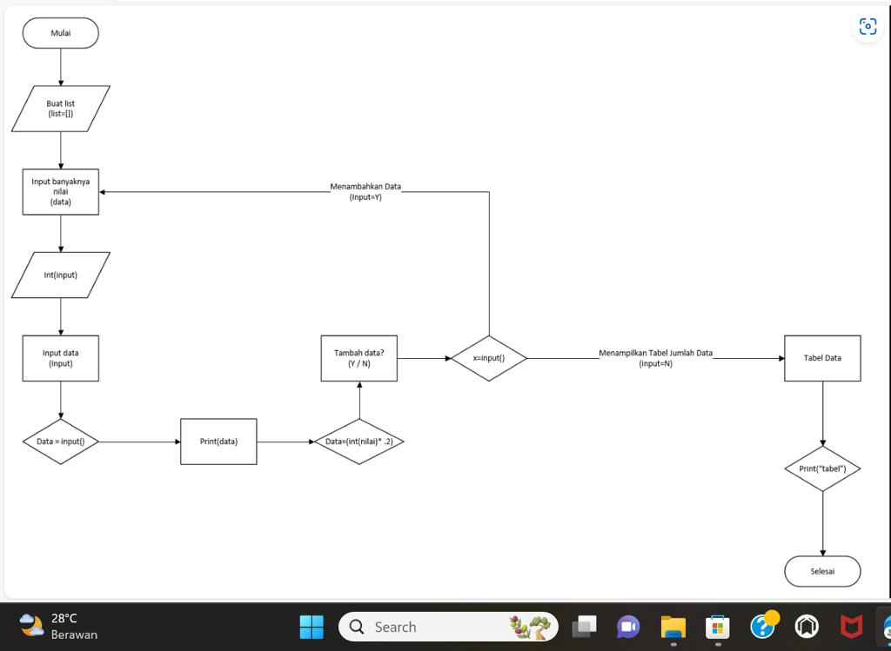
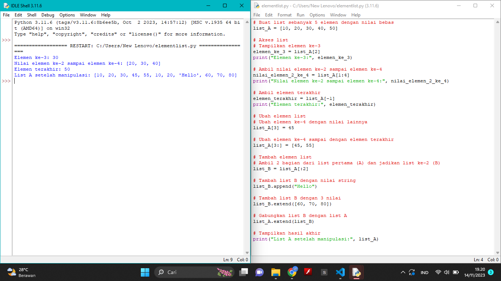
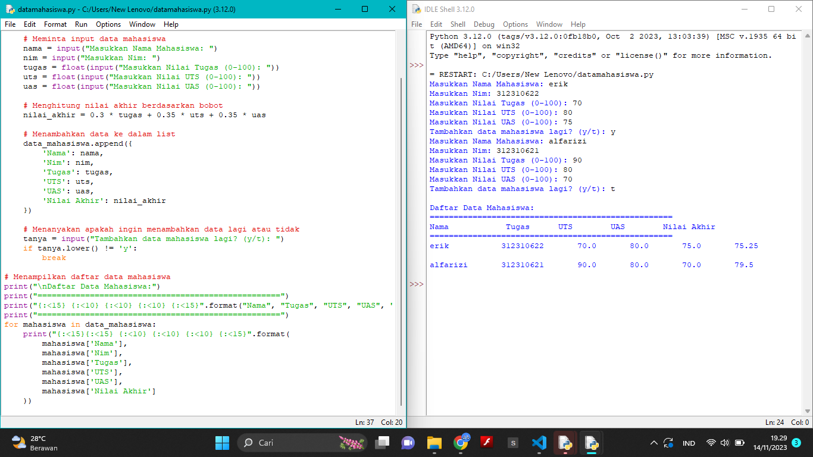

# Praktikum.4
 1.Buatlah list berupa Nama, Nim, Nilai tugas, Nilai UTS, Nilai UAS
 2.Lalu inputlah Nama, Nim, Nilai tugas, Nilai UTS, Nilai UAS
 3.Jika ingin menambah list data ketik "ya" dan jikalau tidak ingin menambahkan list data ketik "tidak". Dengan perintah while jawab =="ya" dan if jawab ="tidak". Jawab input(("Tambah data y/t")).
 4.Gunakan perintah append pada Nama, Nim, Nilai tugas, Nilai UTS, Nilai UAS untuk menambahkan 1 item ke elemen terakhir.
Lalu mencari nilai akhir dengan perhitungan nilai tugas 30%, nilai uts 35% dan uas 35% , dengan perintah float
 5.Gunakanlah perulangan for, dengan perintah for i in range(len(Nama)):. Fungsi "len" ialah untuk mengembalikan panjang (jumlah anggota) dari suatu objek.
 6.Lalu cetak dengan perintah print(i+1,Nama[i],Nim[i],TGS[i],UTS[i],UAS[i],Nilaiakhir[i] )
 7.Selesai

flowchart

